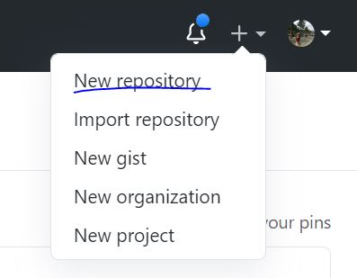
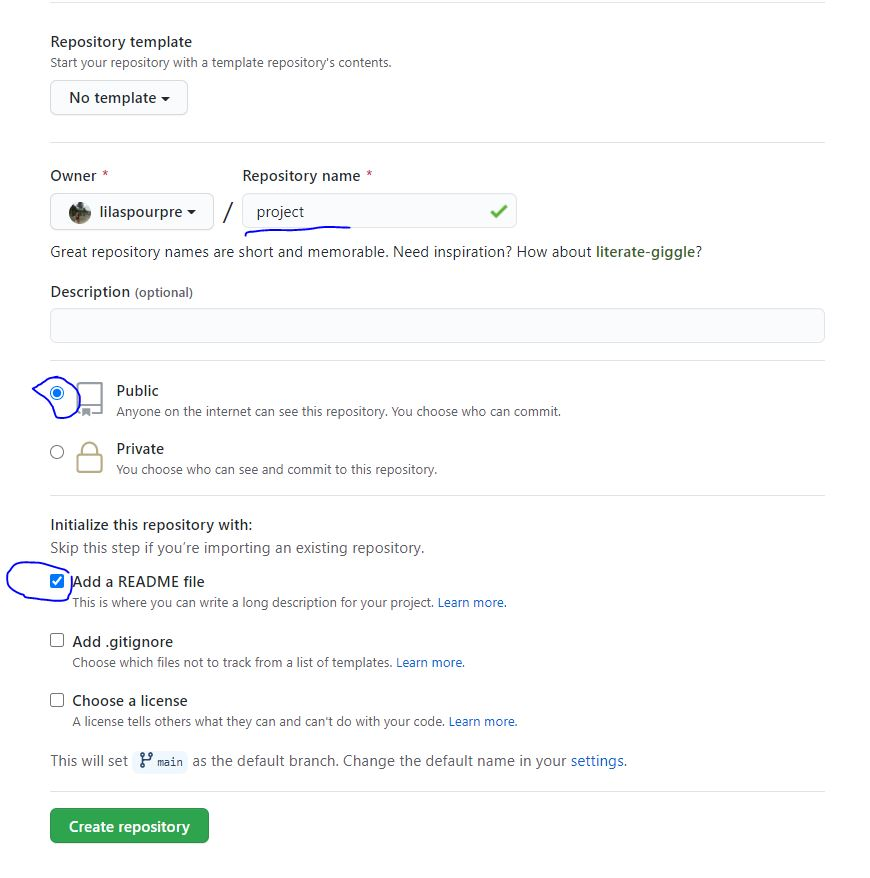
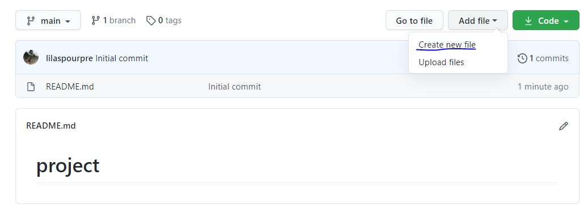
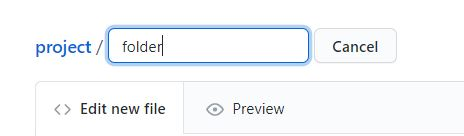
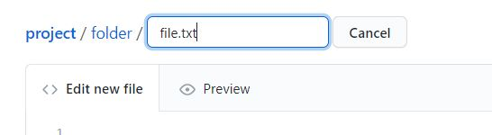
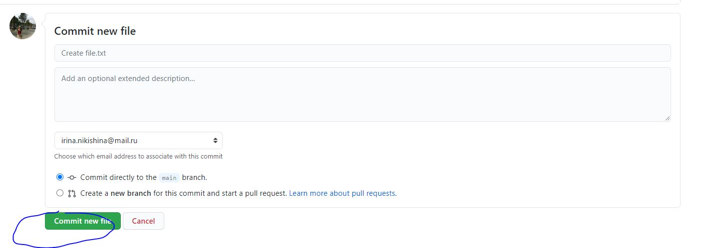
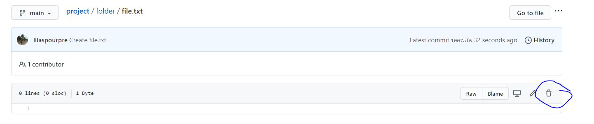
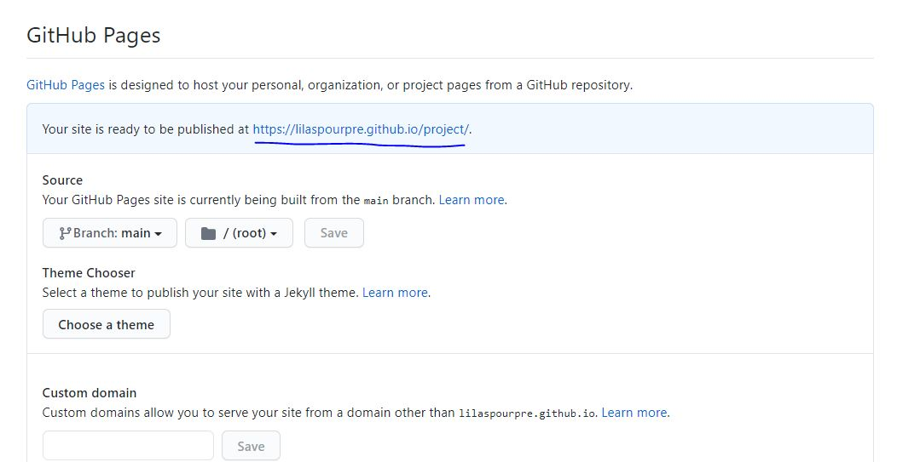

# Lecture 7. Project presentation

## Github

Наша с вами задача на сегодня -- оформить ваше исследование в красивый сайт/текст. Для этого нам понадобится гитхаб.

Этот документ создан при помощи разметки github markdown. Все возможности разметки описаны [тут](https://guides.github.com/features/mastering-markdown/). 
Очень похожий markdowm у jupyter notebooks, в которых мы с вами занимается. Т.е. вы сможете писать и там тоже.

Для начала давайте создадим репозиторий (наша будущая папка, где будет храниться сайт, материалы).

### Создание репозитория

1. Найдите плюсик в верхнем правом углу => **New Repository**

2. Введите название проекта (**на английском и без пробелов**), не забудьте нажать галочку `ADD a README.md file`, потом кнопку `create repository`

### Редактирование описания проекта

1. Если нажать на карандашик справа у файла, этот файл можно редактировать. 

2. Далее вы пишите текст отчета по вашему проекту в файле README.md

На паре мы должны были научиться вставлять картинки, ссылки, таблички, заголовки и линии.

3. Сохраняем ваши изменения 

### Создание папок на гитхабе (вдруг вы картинки захотите положить в одну папку, а код -- в другую)

1. В вашем репозитории нажимаем кнопку "создать файл"

2. Пишем название папки воот сюда и ставим `/`

3. Создалась папка. Эту операцию можно производить несколько раз, а можно успокоиться и написать название файла (любое, этот файл нужен нам только ради папки, заполнять его не нужно)

4. Сохраняем файл, нажимем `commit changes` (сохранится и папка)

5. Загружаем файлы в нужную нам папку (не забываем нажать коммит для загрузки)

6. Удаляем наш файлик. ТОЛЬКО ПОСЛЕ ТОГО, КАК ЗАГРУЗИЛИ В ПАПКУ НУЖНЫЕ ФАЙЛЫ, ИНАЧЕ ПАПКА ТОЖЕ УДАЛИТСЯ

### Создание сайта при помощи Github Pages

1. Заходим в настройки

2. Листаем вниз до пункта Github Pages. Выбираем main (1) и нажимаем save (2)

3. Страничка обновится и вы снова попадете в настройки. Полистайте вниз до GitHub Pages. Там  должна быть ссылка на ваш сайт. 

