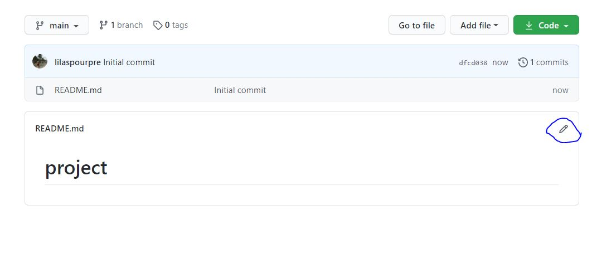
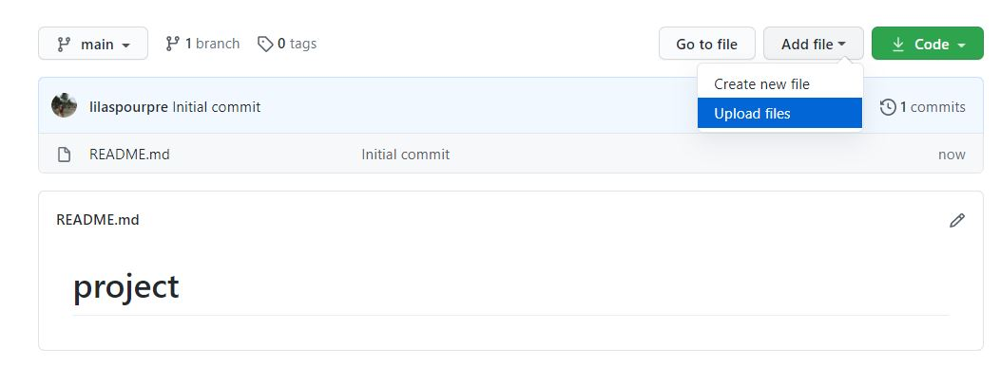

# Lecture 7. Project presentation

## Github

Наша с вами задача на сегодня -- оформить ваше исследование в красивый сайт/текст. Для этого нам понадобится гитхаб.

Этот документ создан при помощи разметки github markdown. Все возможности разметки описаны [тут](https://guides.github.com/features/mastering-markdown/). 
Очень похожий markdowm у jupyter notebooks, в которых мы с вами занимается. Т.е. вы сможете писать и там тоже.

Для начала давайте создадим репозиторий (наша будущая папка, где будет храниться сайт, материалы).

### Создание репозитория

1. Найдите плюсик в верхнем правом углу => **New Repository**

2. Введите название проекта (**на английском и без пробелов**), не забудьте нажать галочку `ADD a README.md file`, потом кнопку `create repository`

### Редактирование описания проекта

3. Если нажать на карандашик справа у файла, этот файл можно редактировать. 

4. Далее вы пишите текст отчета по вашему проекту в файле README.md в режиме markdown. На паре мы должны были научиться вставлять картинки, ссылки, таблички, заголовки и линии.
Воплотит

